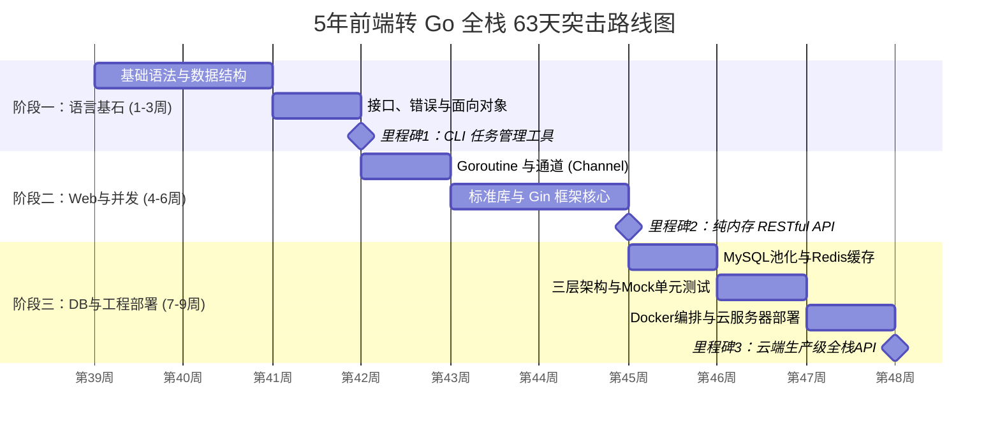

这是一份为你量身定制、完美融合了**高并发特性**与**企业级数据库/缓存调优**的 63 天终极全栈学习计划。

请直接复制以下全部内容，保存为 Markdown 文件后使用支持 Mermaid 的阅读器（如 Notion, Typora, 或 VS Code）打开。

***

### 文件名：`go-learning-plan-[xjm].md`

# 🗺️ 一、 Go 语言渐进式学习图谱 (9周全栈重载版)

---

# ⏱️ 二、 每日任务执行模板 (工作日45m / 周末2h)

> **💡 架构师建议：** 严格遵循番茄钟，切忌复制粘贴，建立强类型语言的肌肉记忆。

*   **📖 理论摄入 (20 min):** 带着“前端/Node对比”的思维阅读官方文档或推荐博客。
*   **💻 编码实战 (25 min):** 纯净敲代码时间，关注编译器的报错提示。
*   **🔄 总结复盘 (5 min):** 在代码顶部写注释回答：“今天踩了什么坑？与 JS/Node.js 逻辑有什么根本不同？”

---

# 📅 三、 63 天核心执行路线（含微型项目矩阵）

## 🧱 阶段一：Go 语言基石 (第 1-3 周)

### 第 1 周：打破前端语法舒适区
*   **Day 1: 环境与 Hello World** `[理论]` Go 模块管理 (`go mod`)。对比 `go.mod` 与 `package.json`。`[编码]` 运行 `fmt.Println("Hello Go")`。
*   **Day 2: 变量与强类型** `[理论]` `var`, `:=` 及基础类型。`[编码]` 编写商品总价计算器。`[复盘]` `:=` 相当于 `let`，但未使用会直接编译报错。
*   **Day 3: 控制流** `[理论]` `for` (无 while), `if`, `switch`。`[编码]` 实现 FizzBuzz 算法。`[复盘]` Go 的 `if` 条件无需括号 `()`。
*   **Day 4: 函数与多返回值** `[理论]` 具名返回值。`[编码]` 编写计算器函数，返回结果和错误信息 `(result, err)`，替代前端的 `throw Error`。
*   **Day 5: 跨越天堑——指针初探** `[理论]` 内存地址 `&` 与指针取值 `*`。`[编码]` 写 `swap` 函数交换变量。`[复盘]` JS 对象默认传引用，Go 默认传值拷贝，想改原值必须用指针。
*   **Day 6 (周末2h): 结构体 (Struct)** `[理论]` Go 没有 Class。`[编码1.5h]` 定义包含多类型的 `User` 结构体并实例化。
*   **Day 7 (周末2h): 数组与切片 (Slice)** `[理论]` 区分 Array 和动态 Slice。`[编码1.5h]` 验证切片扩容机制：循环 `append` 100个元素，打印底层内存地址变化。

### 第 2 周：复合结构与 IO
*   **▶️ Mini-Project 1: 内存版单词本 CLI (Day 8-10)**
    *   **Day 8 [Map映射]:** 初始化 `map[string]string`。取值需用 `val, ok := m[key]` 防范零值。
    *   **Day 9 [方法 Receiver]:** 为 Struct 绑定 `Add()` 和 `Search()` 方法。
    *   **Day 10 [标准输入输出]:** 用 `fmt.Scan` 写无限循环终端交互，串联功能让项目跑起来。
*   **▶️ Mini-Project 2: JSON 配置解析器 (Day 11-13)**
    *   **Day 11 [JSON序列化]:** 学习 `encoding/json` 及 Struct Tag。
    *   **Day 12 [JSON反序列化]:** 接收复杂 JSON 解析到嵌套 Struct。对比：前端 `JSON.parse` 随便转，Go 必须字段首字母大写且 Tag 对齐。
    *   **Day 13 (周末2h) [文件读写]:** `os.ReadFile/WriteFile`。读取 `config.json`，修改端口号后写回。
*   **Day 14 (周末2h):** 查漏补缺，运行 `golangci-lint` 检查代码规范。

### 第 3 周：接口、错误与里程碑
*   **▶️ Mini-Project 3: 面向接口的日志器 (Day 15-17)**
    *   **Day 15 [错误处理]:** 自定义 `error`。习惯满屏的 `if err != nil`。
    *   **Day 16 [接口 Interface]:** 定义 `Logger` 接口（包含 `Info`, `Error`）。
    *   **Day 17 [多态实战]:** 实现 `ConsoleLogger` 和 `FileLogger`，主函数动态切换，体会“鸭子类型”的隐式实现。
*   **🎯 检查点 1: CLI 任务管理器 (Todo-List) (Day 18-21)**
    *   **Day 18 [Defer]:** 学习 `defer` 清理资源，底层模块确保 `defer file.Close()`。
    *   **Day 19 [CLI 参数]:** 用 `os.Args` 解析 `go run main.go add "Buy Milk"`。
    *   **Day 20 (周末2h) [核心逻辑串接]:** 结合 JSON 读写与参数解析，实现 Add/List/Done。
    *   **Day 21 (周末2h) [交付打磨]:** 修复边界空文件报错，**里程碑 1 达成！**

---

## 🌐 阶段二：并发与 Web 核心 (第 4-6 周)

### 第 4 周：并发编程 (Go 的灵魂)
*   **▶️ Mini-Project 4: 并发网站探活 (Day 22-24)**
    *   **Day 22 [Goroutine]:** `go` 关键字与 `WaitGroup`。并发模拟请求 10 个网站。对比 JS `Promise.all`。
    *   **Day 23 [通道 Channel]:** 加入 Channel，将探测结果安全发回主协程。
    *   **Day 24 [Select 超时控制]:** 用 `select` 语法实现：2秒未收到 Channel 消息则报超时。
*   **▶️ Mini-Project 5: 图片下载器 Worker Pool (Day 25-27)**
    *   **Day 25 [通道遍历]:** 生产者发送 50 个任务 ID 到 Channel 并 `close()`。
    *   **Day 26 [互斥锁 Mutex]:** 多协程同时修改 `count++`，用锁防数据竞争。
    *   **Day 27 (周末2h) [Worker Pool]:** 开启 3 个固定 Worker 消费任务（后端经典并发模型）。
*   **Day 28 (周末2h):** 运行 `go run -race` 检查昨天的代码，透彻理解竞态条件。

### 第 5 周：原生 Web 服务
*   **▶️ Mini-Project 6: 极简静态服务器 (Day 29-31)**
    *   **Day 29 [HTTP 基础]:** `net/http` 启动 8080 端口，实现 `/ping` 接口。
    *   **Day 30 [解析 Request]:** 从 URL 读取 Query 参数并返回 JSON。
    *   **Day 31 [静态托管]:** `http.FileServer` 暴露本地 `./public` 目录。
*   **▶️ Mini-Project 7: 聚合 API 网关 (Day 32-34)**
    *   **Day 32 [HTTP Client]:** 发起外部网络请求调用开源天气 API。
    *   **Day 33 [Context 拦截]:** 使用 `context.WithTimeout` 给外部请求加 1 秒硬超时。
    *   **Day 34 (周末2h) [并发聚合]:** 接口内部**并发**请求天气和新闻 API，组装大 JSON 返回。
*   **Day 35 (周末2h):** 为原生 API 编写一个计算请求耗时的中间件闭包。

### 第 6 周：Gin 框架与里程碑
*   **▶️ Mini-Project 8: 鉴权 API (Day 36-38)**
    *   **Day 36 [Gin 入门]:** 替换标准库，用 Gin 重写 `/ping`。对比 Express/Koa。
    *   **Day 37 [参数绑定]:** `ShouldBindJSON` 实现 POST `/login`，校验缺失参数自动返 400。
    *   **Day 38 [中间件]:** 实现 `AuthMiddleware` 洋葱模型拦截无 Token 请求。
*   **🎯 检查点 2: 纯内存版 RESTful API (Day 39-42)**
    *   **Day 39 [路由分组]:** 设定 `/api/v1`。
    *   **Day 40 [控制器分离]:** 将逻辑抽离到 `controllers/user.go`。
    *   **Day 41 (周末2h) [完成 CRUD]:** 基于全局 Map + Mutex 锁，实现 GET/POST/PUT/DELETE。
    *   **Day 42 (周末2h) [联调测试]:** Postman 跑通全流程，**里程碑 2 达成！**

---

## 🚀 阶段三：DB 调优与工程部署 (第 7-9 周)

### 第 7 周：企业级关系型数据库 (MySQL/PostgreSQL)
*   **▶️ Mini-Project 9: 原生 SQL 与连接池 (Day 43-45)**
    *   **Day 43 [连接池防漏]:** 配置 `SetMaxOpenConns`。⚠️ **死穴：** 每次 `db.Query` 后必须执行 `defer rows.Close()`，否则瞬间连接泄漏！
    *   **Day 44 [原生预编译]:** 用原生 SQL 防注入查询 User。处理 `sql.NullString`。
    *   **Day 45 [引入 GORM]:** 替换原生代码，实现链式调用的增删查。
*   **▶️ Mini-Project 10: 银行转账事务系统 (Day 46-48)**
    *   **Day 46 [关系与预加载]:** 建立 User 和 Account 一对多模型。
    *   **Day 47 [事务 Transaction]:** 编写转账核心：A扣钱B加钱，遇错 `Rollback` 否则 `Commit`。
    *   **Day 48 (周末2h) [并发锁]:** 模拟 100 人同时转账，引入 GORM **悲观锁** `FOR UPDATE` 解决数据覆盖。
*   **Day 49 (周末2h):** 打印底层 SQL 分析 N+1 查询问题。

### 第 8 周：Redis 缓存与分层架构解耦
*   **▶️ Mini-Project 11: Redis 旁路缓存模式 (Day 50-52)**
    *   **Day 50 [Redis 客户端]:** 引入 `go-redis/redis` 连通容器。
    *   **Day 51 [Cache Aside]:** 重写查询：先读 Redis，未命中读 MySQL 并回写 Redis (设 5 分钟过期)。
    *   **Day 52 [序列化存取]:** 将 Struct `json.Marshal` 为字符串存 Redis，读取时反序列化。
*   **▶️ Mini-Project 12: 三层架构与 Mock 测试 (Day 53-55)**
    *   **Day 53 [Repo 模式]:** 建立 `UserRepository` 接口，封装 MySQL+Redis 双读逻辑，隔离底层。
    *   **Day 54 [依赖注入]:** Repo 注入 Service，Service 注入 Controller。Controller 只管 HTTP 状态码。
    *   **Day 55 (周末2h) [Mock 测试]:** 使用 `sqlmock`，在不连接真实数据库的情况下，跑通 Service 层逻辑的单元测试。
*   **Day 56 (周末2h):** 抽离硬编码，引入 Viper 读取 YAML 配置。

### 第 9 周：容器化部署与终极里程碑
*   **▶️ Mini-Project 13: 容器化 Go 应用 (Day 57-59)**
    *   **Day 57 [Dockerfile]:** Go 编译产物无依赖环境。编写初版 Dockerfile。
    *   **Day 58 [多阶段构建]:** 使用 Multi-stage build 将镜像体积从 800MB 压缩至 20MB。
    *   **Day 59 [Docker Compose]:** 编写 YAML，一键拉起 Go API、MySQL 和 Redis 三个容器网络。
*   **🎯 检查点 3: 云端生产级 API 部署 (Day 60-63)**
    *   **Day 60 [交叉编译]:** 使用 `GOOS=linux GOARCH=amd64 go build` 本地打出 Linux 包。
    *   **Day 61 [服务器环境]:** SSH 登录云主机，安装 Docker 基础环境。
    *   **Day 62 (周末2h) [公网部署]:** `docker-compose up -d` 启动服务，配置云防火墙放行端口。
    *   **Day 63 (周末2h) [终极联调]:** 用本地 Postman 访问公网 IP，走通整套 `增删改查 -> 缓存 -> 库` 逻辑。**终极里程碑达成，晋升全栈！**

---

# ⚠️ 四、 架构师必读：前端转 Go 的 10 个致命陷阱速查表

| 序号 | 陷阱 / 前端固有思维 | 真实 Go 企业级要求 | 解决方案 |
| :--- | :--- | :--- | :--- |
| **1** | `export default` 导出模块 | 没有任何 export 关键字，**首字母大写**代表公有，小写为私有包内可见。 | 强迫症检查：想暴露给包外的函数、结构体字段，必须大写！ |
| **2** | 框架托管数据库连接池 | 原生自带连接池，**极其容易发生连接泄漏**导致服务宕机。 | 只要写了 `rows, err := db.Query`，紧接着下一行必须是 `defer rows.Close()`！ |
| **3** | 对象全是引用传递 | `Struct` 默认是**值传递**（完全拷贝）。 | 传参、修改 GORM 模型时，务必使用**指针** `&User{}` 和 `*User`。 |
| **4** | DB中的 `NULL` 变 `null` | Go 基本类型不能为 `nil`，遇到 DB 返回 NULL 会直接 Panic。 | 数据库字段可能为空时，用 `sql.NullString` 或 `*string` 接收。 |
| **5** | 单线程无脑并发写数据 | Go 是真多线程，并发修改同一资源会产生竞态覆盖 (Race Condition)。 | 高并发写内存加 `sync.Mutex`，高并发写库用事务+`FOR UPDATE` 悲观锁。 |
| **6** | `try { ... } catch (e)` | Go 拒绝抛异常打断控制流，错误作为普通返回值。 | 拥抱 `if err != nil`。每一层都要明确处理可能失败的步骤。 |
| **7** | `JSON.parse` 随便解 | 必须提前定义强类型的 `Struct` 并配置 Tag 映射。 | 不确定的动态结构只能用 `map[string]any`，但在业务中强烈不推荐。 |
| **8** | 闭包捕获循环变量 | 在 `for` 循环中开启 `go func()`，协程拿到的全是最后一个变量值。 | 将变量通过传参的方式送入闭包：`go func(val string) { ... }(item)`。 |
| **9** | 数组随便 `push` | `Slice` 在 `append` 时可能会扩容并分配新内存地址。 | 必须写成 `s = append(s, val)`，绝不能丢弃返回值。 |
| **10** | `setTimeout` 异步延时 | `time.Sleep` 是同步的，会**卡死当前运行的整个协程**。 | 想要不阻塞主流程的延时，必须开启新协程：`go func(){ time.Sleep() }() `。 |

---

# 📚 五、 资源优先级排序 (严格按照此顺序食用)

**1. 免费 + 官方 (最高优先级 - 每天理论摄入首选)**
*   🥇 **A Tour of Go (Go 语言之旅):** [tour.go-zh.org](https://tour.go-zh.org/) (必须全通，自带交互环境)
*   🥈 **Go by Example:** [gobyexample.com](https://gobyexample.com/) (查语法片段、并发写法的神器)
*   🥉 **GORM & Gin 官方中文文档:** 极其优秀，无需看其他博客。

**2. 免费 + 社区高质量实战**
*   🥇 **GeekTutu (极客兔兔) Go 语言简明教程:** 适合国内开发者的通俗教程。
*   🥈 **Go Web 编程 (地鼠文档):** 涵盖了详细的 Web 底层实现逻辑。

**3. 付费 + 经典书籍 (深度进阶，周末阅读)**
*   🥇 **《Let's Go》 / 《Let's Go Further》 by Alex Edwards:** (英文版极佳) 手把手教你如何用高级架构师思维写纯净的 API 和服务。
*   🥈 **《Go语言实战》 (Go in Action):** 偏底层机制解析（切片、接口内部结构、并发调度器原理）。
*   

